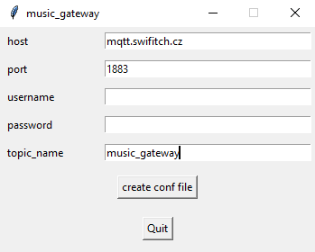

# Music Gateway

A repository to control music over mobile network with the MQTT protocol

## Installation

### Windows
open terminal and clone this repository:

`git clone https://github.com/bierschi/music_gateway.git`

and go into folder `music_gateway`:

`cd music_gateway`

install the project with `setup.py` (python version 3.5, change this value with your installed python version > 3):

`py -3.5 setup.py install`

Enter the correct parameters for the `configuration.json` file

   
  

### Linux

open terminal and clone this repository:

`git clone https://github.com/bierschi/music_gateway.git`

and go into folder `music_gateway`:

`cd music_gateway`

install the project with `setup.py`:

`python3 setup.py install`

Enter the correct parameters for the `configuration.json` file

   
  

## Settings in file `configuration.json`

example settings for a public broker. `topic` can be any desired string

<pre><code>
{
  "MQTT": {
    "host"    : "mqtt.swifitch.cz",
    "port"    : "1883",
    "username": "",
    "password": ""
  },
  "TOPIC_NAME":{
    "topic"    : "music_gateway"
  }
}
</pre></code>

## Current Status / Testing

Download a mqtt client like MQTT.FX http://mqttfx.jensd.de/index.php/download

#### Subscribe following `publish_topics` to see all songs in database, the current playback state and gps data if a gps sensor is connected

publish_topics:
- `music_gateway/pub/database`  
- `music_gateway/pub/playback`  
<pre><code>
{
  "player_status" : {
    "playlistlength" : "1",
    "songid" : "1",
    "single" : "0",
    "repeat" : "0",
    "state" : "stop",
    "mixrampdb" : "0.000000",
    "consume" : "0",
    "volume" : "-1",
    "random" : "0",
    "song" : "0",
    "playlist" : "2"
  },
  "current_song" : {
    "pos" : "0",
    "file" : "Marshmello & Anne - Marie - FRIENDS (Lyric Video) _OFFICIAL FRIENDZONE.mp3",
    "title" : "Marie - FRIENDS (Lyric Video) *OFFICIAL FRIENDZONE",
    "duration" : "205.610",
    "last-modified" : "2018-03-23T13:56:25Z",
    "time" : "206",
    "artist" : "Marshmello & Anne",
    "id" : "1"
  },
  "song_playlist" : [ "Marshmello & Anne - Marie - FRIENDS (Lyric Video) _OFFICIAL FRIENDZONE.mp3" ]
}

</pre></code>
- `music_gateway/pub/gps`

<pre><code>
{
  "gps_data" : {
    "longitude" : "11.600309666666666",
    "number_of_sat" : "06",
    "time" : "171500.00",
    "latitude" : "49.152718166666666",
    "nmea_dataformat" : "$GPGGA",
    "height_over_msl" : "491.4"
  }
}
</pre></code>
#### Publish the following actions on this topic:

subscribe_topics:
- `music_gateway/sub/song_control`

This commands are working:

<pre><code>
{"action": "play"}
{"action": "stop"}
{"action": "next"}
{"action": "previous"}
{"action": "pause"}
{"action": "shuffle"}
{"action": "clear_playlist"}
{"action": "random"}
{"action": "repeat"}
{"action": "update"}

{"desired_song": "Nano - Hold On(Official Audio).mp3"}
{"add_song": "Nano - Hold On(Official Audio).mp3"}
{"delete_song": "Nano - Hold On(Official Audio).mp3"}
</pre></code>

`add_song`: adds a song from the database into current playlist, song must be available in `music_gateway/pub/database`

`desired_song`: select the desired song from the current playlist

`delete_song`: deletes a song from the current playlist

 

**commands will later be replaced by an APP!**

## Electrical Circuit for Raspberry Pi

## Project Layout
<pre><code>
/music
    /radio_playlists
        .m3u files
    /songs
        folder_for_songs
    mpd.exe

/scripts
    music_gateway.sh

/src
    /communication
        gps.py
        internet_connection.py
        mqtt.py
        scan_serial.py
    /player
        connect_mpd.py
        control_mpd.py
        load_mpd.py
    settings.py

/test
    test_gps.py
    test_internet_connection.py
    test_mqtt.py
    test_connect_mpd.py
    test_control_mpd.py
    test_load_mpd.py
    test_scan_serial.py
    test_settings.py

definitions.py
LICENSE
music_gateway.py
README.md
requirements.txt
setup.py
</pre></code>